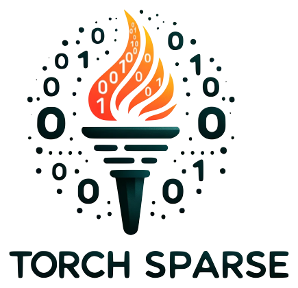
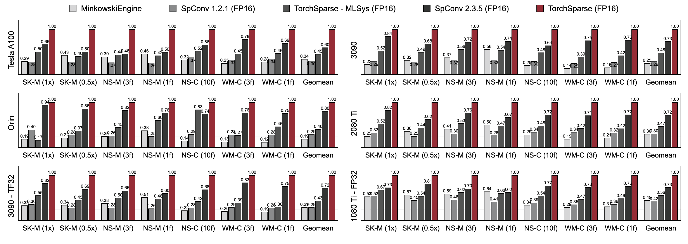
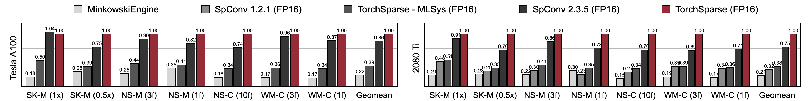

# TorchSparse

TorchSparse is a high-performance neural network library for point cloud processing.

### [website](http://torchsparse.mit.edu/) | [paper](https://arxiv.org/abs/2204.10319) | [presentation](https://www.youtube.com/watch?v=IIh4EwmcLUs) | [documents](http://torchsparse-docs.github.io/) | [pypi server](http://pypi.hanlab.ai/simple/torchsparse)

## Introduction

<p align="center">


TorchSparse is a high-performance neural network library for point cloud processing.

______________________________________________________________________

# TorchSparse for Zendar

This repository is used to build custom TorchSparse wheels that depend on specific versions of PyTorch. Updates are made only when a new PyTorch version is required—typically driven by CUDA driver updates at Zendar.

When CUDA is updated, we often need to update PyTorch to a version that supports the new CUDA version. In turn, this means TorchSparse must be rebuilt against the updated PyTorch. This is often as simple as updating the dependency, though in some cases minor source code changes may be required to accommodate changes in the PyTorch interface.

This guide outlines how to build TorchSparse wheels, particularly when upgrading to a newer PyTorch version.

______________________________________________________________________

## 🔧 Building TorchSparse

### 1. Install PDM (Python Development Master)

TorchSparse builds require [PDM](https://pdm-project.org/). To install it:

```bash
curl -sSL -o install-pdm.py https://raw.githubusercontent.com/pdm-project/pdm/2.5.3/install-pdm.py
python3 install-pdm.py --version 2.5.3 --path /tmp
```

> This installs PDM in `/tmp/bin/pdm`.

______________________________________________________________________

### 2. Create a New Branch

Create a new branch off of `zendar-main` for your changes:

```bash
git checkout -b build/torchsparse-new-version zendar-main
```

______________________________________________________________________

### 3. Update Dependencies

Update `pyproject.toml` if dependencies have changed:

- Modify the `dependencies` section.
- Also update the `[build-system] requires` section to reflect the correct PyTorch version.

______________________________________________________________________

### 4. Build the Project (Editable Mode)

Set the correct CUDA environment and run the build:

```bash
export CUDA_PATH=/usr/local/cuda # Make sure this is the correct CUDA version for PyTorch
export LD_LIBRARY_PATH=${CUDA_PATH}/lib64

/tmp/bin/pdm sync --clean
```

#### Troubleshooting

If the command fails, consider the following:

- Ensure only one CUDA installation exists on your machine.
- Complete the CUDA post-installation steps. For example:

```bash
# Replace 12.8 with your CUDA version
export PATH=/usr/local/cuda-12.8/bin${PATH:+:${PATH}}
export LD_LIBRARY_PATH=/usr/local/cuda-12.8/lib64${LD_LIBRARY_PATH:+:${LD_LIBRARY_PATH}}
```

- Re-run the build with verbosity enabled to help diagnose issues:

```bash
/tmp/bin/pdm sync --clean -v
```

- If you encounter `nvcc` errors, check that the correct compiler is being used.
- Some source-level changes may be needed if the TorchSparse code is not compatible with the new PyTorch interface. These changes are usually minor.

______________________________________________________________________

### 5. Update Version

Update the TorchSparse version in `torchsparse/version.py`.

______________________________________________________________________

### 6. Build the Wheel

Build the new wheels:

```bash
/tmp/bin/pdm build

# if build dies due to out of memory (oom), limit parallelism with:
export MAX_JOBS=4
```

______________________________________________________________________

### 7. Submit Changes

- Open a Pull Request targeting `zendar-main`.
- After review and approval, merge the PR.

______________________________________________________________________

### 8. Create a Release

Tag a new release and upload the built wheels under the release assets.

______________________________________________________________________

## 9. Upload to GCP Artifact Repository

We recently switched to a package registry hosted in GCP, so to upload your package to the registry, make sure you are signed in with `gcloud auth application-default login` and then use twine to upload your new release.

```bash
TWINE_PASSWORD=$(gcloud auth print-access-token)  /tmp/bin/pdm run twine upload --repository-url https://us-central1-python.pkg.dev/artifacts-443721/python-packages/ —username oauth2accesstoken dist/*
```

That’s it! 🎉

______________________________________________________________________

## 🛠️ Troubleshooting: `undefined symbol` Error During `pdm build` or `pdm sync`

If you encounter an error like this:

```bash
/tmp/bin/pdm build
# or
/tmp/bin/pdm sync
```

```
ImportError: /home/asingh/torchsparse/torchsparseplusplus/backend.cpython-311-x86_64-linux-gnu.so: undefined
symbol: _ZN3c106detail23torchInternalAssertFailEPKcS2_jS2_RKSs
```

It typically indicates a missing shared library (e.g., `libpython.so` or a PyTorch dependency).

### ✅ Fix Steps

#### 1. Check for missing libraries

```bash
ldd /home/asingh/torchsparse/torchsparseplusplus/backend.cpython-311-x86_64-linux-gnu.so
```

Look for any lines showing **“not found”**.

______________________________________________________________________

#### 2. Locate missing libraries

These are often in your virtual environment or the [PDM `__pypackages__`](https://pdm.fming.dev/latest/usage/pep582/) directory:

```bash
find . -name "libpython*.so"
```

______________________________________________________________________

#### 3. Add the path to `LD_LIBRARY_PATH`

```bash
export LD_LIBRARY_PATH=<path-to-dir-containing-libpython.so>:$LD_LIBRARY_PATH
```

> ⚠️ Replace `<path-to-dir-containing-libpython.so>` with the actual directory path (not the file itself).

______________________________________________________________________

### Zendar renames this module Torchsparseplusplus

To aid with integration of the new torchsparse version 2.1.0 into RadarProcessor, the module torchsparse has been renamed torchsparseplusplus. This will be maintained in the branch `zendar-main-tspp`. Torchsparse version 1.4.5 will be maintained on the branch `zendar-main`.

### [website](http://torchsparse.mit.edu/) | [paper (MICRO 2023)](https://www.dropbox.com/scl/fi/obdku0kqxjlkvuom2opk4/paper.pdf?rlkey=0zmy8eq9fzllgkx54zsvwsecf&dl=0) | [paper (MLSys 2022)](https://arxiv.org/abs/2204.10319) | [presentation](https://www.youtube.com/watch?v=IIh4EwmcLUs) | [documents](http://torchsparse-docs.github.io/) | [pypi server](http://pypi.hanlab.ai/simple/torchsparse)

## Introduction

Point cloud computation has become an increasingly more important workload for autonomous driving and other applications. Unlike dense 2D computation, point cloud convolution has **sparse** and **irregular** computation patterns and thus requires dedicated inference system support with specialized high-performance kernels. While existing point cloud deep learning libraries have developed different dataflows for convolution on point clouds, they assume a single dataflow throughout the execution of the entire model. In this work, we systematically analyze and improve existing dataflows. Our resulting system, TorchSparse, achieves **2.9x**, **3.3x**, **2.2x** and **1.7x** measured end-to-end speedup on an NVIDIA A100 GPU over the state-of-the-art MinkowskiEngine, SpConv 1.2, TorchSparse (MLSys) and SpConv v2 in inference respectively.

## News

**\[2023/10/30\]** We present TorchSparse++ at 56th IEEE/ACM International Symposium on Microarchitecture (MICRO 2023). We also fully release the source code of TorchSparse++.

**\[2023/6/18\]** TorchSparse++ has been released and presented at CVPR 2023 workshops on autonomous driving. It achieves 1.7-2.9x inference speedup over previous state-of-the-art systems.

**\[2022/8/29\]** TorchSparse is presented at MLSys 2022. Talk video is available [here](https://www.youtube.com/watch?v=IIh4EwmcLUs).

**\[2022/1/15\]** TorchSparse has been accepted to MLSys 2022, featuring adaptive matrix multiplication grouping and locality-aware memory access.

**\[2021/6/24\]** TorchSparse v1.4 has been released.

### Installation

We provide pre-built torchsparse v2.1.0 packages (recommended) with different PyTorch and CUDA versions to simplify the building for the Linux system.

1. Ensure at least PyTorch 1.9.0 is installed:

   ```bash
   python -c "import torch; print(torch.__version__)"
   >>> 1.10.0
   ```

1. If you want to use TorchSparse with gpus, please ensure PyTorch was installed with CUDA:

   ```bash
   python -c "import torch; print(torch.version.cuda)"
   >>> 11.3
   ```

1. Then the right TorchSparse wheel can be found and installed by running the installation script:

   ```bash
   python -c "$(curl -fsSL https://raw.githubusercontent.com/mit-han-lab/torchsparse/master/install.py)"
   ```

If Pypi server does not work as expected, no worries, you can still manually download the wheels. The wheels are listed in [this website](http://pypi.hanlab.ai/simple/torchsparse). One can utilize our installation script to automatically determine the version number used to index the wheels. For example, if you use PyTorch 1.11.0, CUDA 11.5, the version number will end up to be 2.1.0+torch111cu115. You can then select the proper wheel according to your Python version.

You may also alternatively install our library from source via:

```bash
python setup.py install
```

## Benchmarks

### Inference benchmarks



TorchSparse significantly outperforms existing point cloud inference engines in both 3D object detection and LiDAR segmentation benchmarks across three generations of GPU architecture (Pascal, Turing and Ampere)  and all precisions (FP16, TF32, FP32). It is up to **1.7x** faster than state-of-the-art SpConv 2.3.5 and is up to **2.2x** faster than
TorchSparse-MLsys on cloud GPUs. It also improves the latency of SpConv 2.3.5 by **1.25×** on Orin.

### Training benchmarks



TorchSparse achieves superior mixed-precision training speed compared with MinkowskiEngine, TorchSparse-MLSys and SpConv 2.3.5. Specifically, it is **1.16x** faster on Tesla A100, **1.27x** faster on RTX 2080 Ti than state-of-the-art SpConv 2.3.5. It also significantly outperforms MinkowskiEngine by **4.6-4.8x** across seven benchmarks on A100 and 2080 Ti. Measured with batch size = 2.

You may find our benchmarks from [this link](https://zenodo.org/records/8311889). To access preprocessed datasets, please contact the authors. We cannot publicly release raw data from SemanticKITTI, nuScenes and Waymo due to license requirements.

## Team

TorchSparse is developed by the following wonderful team:

- [Haotian Tang](http://kentang.net): Ph.D. student (2020-) at MIT EECS, project lead, v2.0 and v2.1 lead;
- [Shang Yang](http://ys-2020.github.io): Ph.D. student (2023-) at MIT EECS, project lead, v2.1 lead;
- [Zhijian Liu](http://zhijianliu.com): Ph.D. student (2018-) at MIT EECS, project lead, v2.0 lead;
- [Xiuyu Li](http://xiuyuli.com): Ph.D. student (2022-) at UC Berkeley EECS, v2.0 lead;
- [Ke Hong](https://ieeexplore.ieee.org/author/37089419138): Graduate student (2021-) at Tsinghua University EE, v2.1 core developer, authored PCEngine kernels;
- [Zhongming Yu](https://fishmingyu.github.io/): Ph.D. student (2022-) at UCSD CS, v2.1 core developer, authored PCEngine kernels;
- [Yujun Lin](https://yujunlin.com/): Ph.D. student (2018-) at MIT EECS, v2.0 core developer;
- [Yingqi Cao](https://github.com/ioeddk): Undergrad student at UC San Diego, currently working on the TorchSparse++ integration into algorithm frameworks;
- [Guohao Dai](https://scholar.google.com/citations?user=gz3Tkl0AAAAJ&hl=en): Associate Professor at Shanghai Jiao Tong University, mentor of the project;
- [Yu Wang](http://nicsefc.ee.tsinghua.edu.cn/): Professor at Tsinghua University, mentor of the project;
- [Song Han](https://songhan.mit.edu): Associate Professor at MIT EECS, mentor of the project.

## Citation

If you use TorchSparse, please use the following BibTeX entries to cite:

TorchSparse++ (TorchSparse v2.1) is presented at MICRO 2023:

```bibtex
@inproceedings{tangandyang2023torchsparse,
  title={TorchSparse++: Efficient Training and Inference Framework for Sparse Convolution on GPUs},
  author={Tang, Haotian and Yang, Shang and Liu, Zhijian and Hong, Ke and Yu, Zhongming and Li, Xiuyu and Dai, Guohao and Wang, Yu and Han, Song},
  booktitle={IEEE/ACM International Symposium on Microarchitecture (MICRO)},
  year={2023}
}
```

Preliminary version of TorchSparse++ (TorchSparse v2.1) is presented at CVPR Workshops 2023:

```bibtex
@inproceedings{tangandyang2023torchsparse++,
  title = {{TorchSparse++: Efficient Point Cloud Engine}},
  author = {Tang, Haotian and Yang, Shang and Liu, Zhijian and Hong, Ke and Yu, Zhongming and Li, Xiuyu and Dai, Guohao and Wang, Yu and Han, Song},
  booktitle = {Computer Vision and Pattern Recognition Workshops (CVPRW)},
  year = {2023}
}
```

TorchSparse is presented at MLSys 2022:

```bibtex
@inproceedings{tang2022torchsparse,
  title = {{TorchSparse: Efficient Point Cloud Inference Engine}},
  author = {Tang, Haotian and Liu, Zhijian and Li, Xiuyu and Lin, Yujun and Han, Song},
  booktitle = {Conference on Machine Learning and Systems (MLSys)},
  year = {2022}
}
```

Initial version of TorchSparse is part of the SPVNAS paper at ECCV 2020:

```bibtex
@inproceedings{tang2020searching,
  title = {{Searching Efficient 3D Architectures with Sparse Point-Voxel Convolution}},
  author = {Tang, Haotian and Liu, Zhijian and Zhao, Shengyu and Lin, Yujun and Lin, Ji and Wang, Hanrui and Han, Song},
  booktitle = {European Conference on Computer Vision (ECCV)},
  year = {2020}
}
```

PCEngine paper is accepted by MLSys 2023:

```bibtex
@inproceedings{hong2023pcengine,
  title={{Exploiting Hardware Utilization and Adaptive Dataflow for Efficient Sparse Convolution in 3D Point Clouds}},
  author={Hong, Ke and Yu, Zhongming and Dai, Guohao and Yang, Xinhao and Lian, Yaoxiu and Liu, Zehao and Xu, Ningyi and Wang, Yu},
  booktitle={Sixth Conference on Machine Learning and Systems (MLSys)},
  year={2023}
}
```

## Acknowledgement

We thank Yan Yan from TuSimple for helpful discussions. Please also have a look at the [dgSparse](https://dgsparse.github.io/) library, which is designed for fast and efficient sparse computation on graphs and point clouds. The work from PCEngine (MLSys 2023) team is also highly related to us.

TorchSparse is inspired by many existing open-source libraries, including (but not limited to) [MinkowskiEngine](https://github.com/NVIDIA/MinkowskiEngine), [SECOND](https://github.com/traveller59/second.pytorch) and [SparseConvNet](https://github.com/facebookresearch/SparseConvNet).

We also thank [AttributeDict](https://github.com/grimen/python-attributedict/tree/master) for providing an elegant way to manage the kernel/model configurations.
